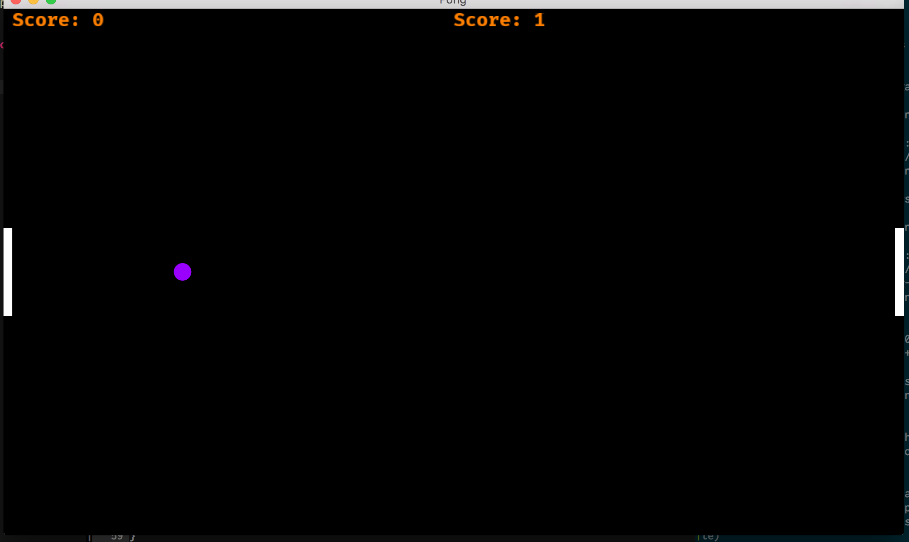

# pong-rs
pong written in Rust using Piston


## Screenshots


## How to play
The left paddle is controlled by moving the mouse cursor. Left click once the game is over to restart. Press ESC to exit the game.

## Running with Cargo
```
cargo run --release
```
Go to [Piston-Tutorials/getting-started](https://github.com/PistonDevelopers/Piston-Tutorials/tree/master/getting-started) to learn how to install Rust and the Piston dependencies.

